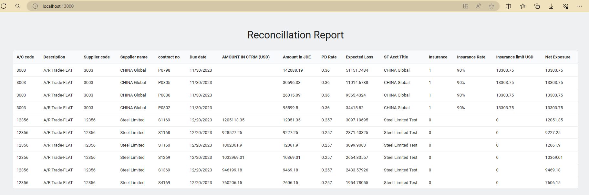

# Reconciliation report demo application

A .Net 8.0 web API with React and Docker support project for demonstration purposes as a assessment result for a fullstack application. 

This project utilizes the .Net 8.0 SDK, React, and Docker to create a development and production environment for a web application.

<figure>

<figcaption>Project's final result UI</figcaption>
</figure>

## About the Project

This is full stack engineering assessment. The expectation is for the candidate to code up a .NET core solution with React for this case study. 

I created this project with .Net 8.0 web API with React and Docker support project for finish the assessment requirements. The project is designed to run as a collection of Docker containers, with the .Net web API running in a container, the React application running in another a container, and a SQLite database running in the same .NET web API container.

It was made to demonstrate how to create a fullstack application with .Net and React to finish the assinged assessment. It provides a good sample for a .Net application with a React frontend, and it is configured to run as a collection of Docker containers, ready for development and production.

## Getting Started

To get started, clone the repository and open the backend .NET soluation file CargillTest.sln in Visual Studio 2022. And open the folder cargilltest-ui in VSCode or Visual Studio 2022 for fontend code.
<br/>
The project is configured to run in a Docker container, so you will need to have Docker Desktop installed. Once you have the project open, you can run the project in Visual Studio 2022 and the application will start in a Docker container.

### Prerequisites

- [Visual Studio 2022](https://visualstudio.microsoft.com/vs/)
- [Docker Desktop](https://www.docker.com/products/docker-desktop)
- [Node.js](https://nodejs.org/en/)
- [React](https://reactjs.org/)
- [.Net 8.0 SDK](https://dotnet.microsoft.com/download/dotnet/8.0)

### Running the Application

You can run the application without Docker or as a collection of Docker containers. Generally, the docker-compose file was designed to run the application in a production environment, but it can also be used for development purposes.

Below are the steps to run the application in both environments:

#### Running the Application without Docker

To run the application without Docker, you can run the .Net application and the React application separately. To run the .Net Web API, open the project in Visual Studio 2022 and choose the host with Kestrel or IISExpress run the application. The swagger page should be shown by default. You can navigate to the `cargilltest-ui` directory and run the following command to launch the client UI application:

```bash
npm install
npm start
```

#### Running the Application with Docker

To run the application with Docker, you can run the following command in the root directory of the project:

```bash
docker compose up -d
```
This will start the .Net Web API, the React UI application in separate Docker containers. You can access the application at `http://localhost:13000`.

## The description of the folders

- Backend
  - CargillTest.DAL: the data access layer code. Include the models and SQLite helper classes. It use the sqlite-net as ORM framework.
  - CargillTest.DAL.UnitTests: the UT test code for the data access layer.
  - CargillTest.API: the .NET web API project to access the SQLite database data and generate the related report for client.
- Frontend
  - cargilltest-ui: the client UI project to show the result generated by the .NET Web API. It use the create-react-app to create the project.
- DockerFiles
  - docker-compose.yml: the config file to run the project by docker compose

## Author

- **[Donald Huang](https://github.com/toponehhh)**
